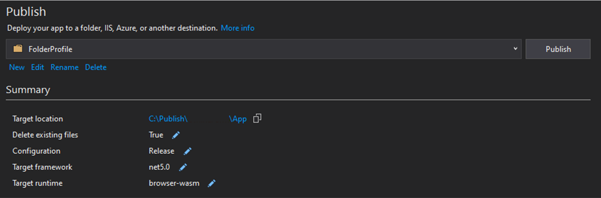
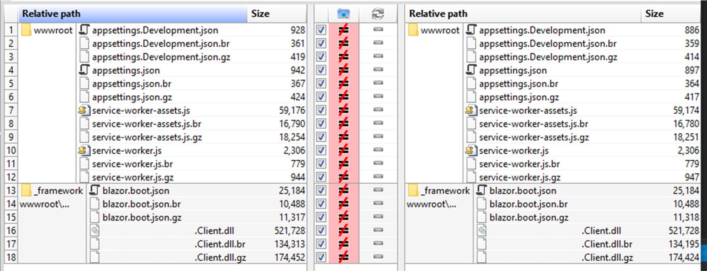
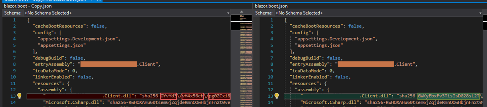
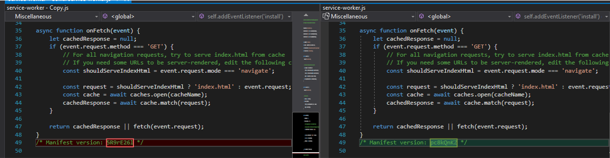
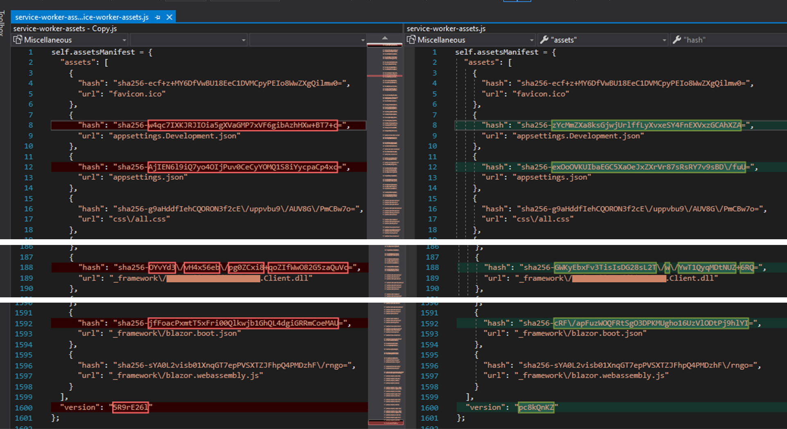
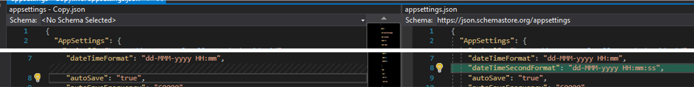
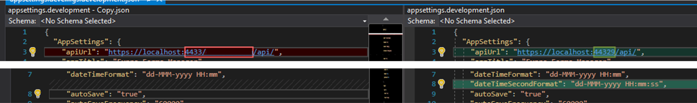

# issue-blazor-webassembly-published-from-another-vs

## Description
I'm having issues trying to deploy a Blazor WebAssembly update to an IIS server.
Previously, my colleague published the app from his VS2019 and deployed it in the server.
However, when I tried publishing the app from my VS2019, the app (from the Chrome browser) wouldn't accept the files I published and deployed in the same server.
The error shown was
> Failed to find a valid digest in the 'integrity' attribute for resource 'some file' with computed SHA-256 integrity

## Update
- Will try to clean app and re-publish. https://github.com/dotnet/aspnetcore/issues/27752

## Steps
I tried comparing the differences between his published files and mine.

Publish the app.

Results of comparing files of different content from both my app and colleague's.

The contents of each file compared with command
`devenv /diff <file1> <file2>`
  

blazor-boot.json

service-worker.js

service-worker-assets.js

appsettings.json

appsettings-development.json
